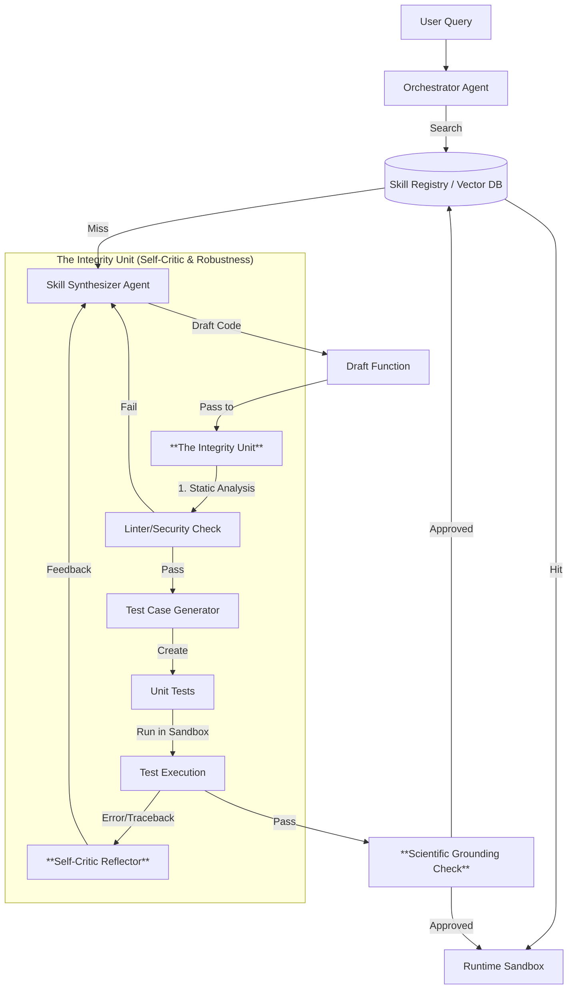

> []()
> 
> This repository is currently facilitating active experiments with the **Robust Adaptive Skill-Accretion (R-ASA)** architecture. We are evaluating multiple approaches to dynamic skill synthesis and verification. Please expect rapid iterations and breaking changes as the core ideas evolve.

# Paper2Agent with Skills: Robust Adaptive Skill-Accretion

> **Note:** This project is an architectural evolution of [Paper2Agent](https://github.com/jmiao24/Paper2Agent) by `jmiao24`. It transforms the original Static Server Model into an Adaptive Skill-Accretion Model.

Paper2Agent re-imagines research dissemination by turning static papers into active AI agents. Each agent serves as an interactive expert on the corresponding paper, capable of demonstrating, applying, and adapting its methods to new projects.

**R-ASA** (Robust Adaptive Skill-Accretion) is the framework powering these agents. Unlike traditional RAG systems that rely on static tools, R-ASA dynamically synthesizes, verifies, and memorizes new "skills" (tools) as it interacts with users, mimicking the learning process of a human researcher.

If something needs to be verified, this architecture grounds and validates it first, then moves forward to provide the LLM online with tools etc.

---

## 1. Core Philosophy: "Trust, but Verify"

We are moving from a **Static Server Model** (the original _Paper2Agent_) to an **Adaptive Skill-Accretion Model**.

| Feature        | Original Paper2Agent          | **R-ASA (This Repo)**                 |
| :------------- | :---------------------------- | :------------------------------------ |
| **Tooling**    | Static (Pre-baked MCP Server) | **Dynamic (Just-in-Time Synthesis)**  |
| **Validation** | Developer-defined             | **Continuous (Integrity Unit)**       |
| **Correction** | None (Fail = Fail)            | **Self-Correction (Reflexion Loop)**  |
| **Memory**     | Stateless                     | **Skill Registry (Accretive Memory)** |

### The "Hybrid Cache" Strategy

- **Novelty:** When you ask a new question, the agent acts as an **Engineer**—it reads the paper, writes new code, tests it, and critiques itself. This takes time (30-60s).
- **Familiarity:** Once a skill is verified, it is saved to the **Skill Registry**. Future requests are instant (<2s), as the agent retrieves the "Verified Skill" just like a standard tool.

---

## 2. Architecture

The system follows a circular robustness flow: `Ask -> Generate -> Critique -> Test -> Execute -> Verify -> Store`.



### Key Components

1.  **Skill Synthesizer (The Engineer)**

    - Reads raw paper code/docs via RAG.
    - Drafts Python functions to solve novel problems.
    - _Constraint:_ Must include type hints and docstrings.

2.  **Integrity Unit (The Robustness Engine)**

    - **Safety Inspector:** Static AST analysis to reject dangerous calls (`os.system`).
    - **Test Engineer:** Generates unit tests based on _intent_, not implementation.
    - **Reflector:** Analyzes tracebacks to provide specific feedback for self-correction.

3.  **Skill Registry (Long-Term Memory)**

    - A Vector Database (ChromaDB) that stores _only_ verified skills.
    - Enables the agent to "learn" and become faster over time.

4.  **Scientific Grounding (The Reviewer)**
    - Verifies that the code's output makes scientific sense contextually (e.g., "P-value cannot be > 1.0").

---

## 3. Installation & Usage

### Prerequisites

- Python 3.9+
- `GEMINI_API_KEY` (or other LLM provider config)

### Option A: Local Installation (Recommended)

We use [uv](https://github.com/astral-sh/uv) for fast, reliable package management.

```bash
# Clone and Install
git clone https://github.com/your-repo/Paper2AgentWithSkills.git
cd Paper2AgentWithSkills

# Create virtualenv and install dependencies
uv venv
source .venv/bin/activate
uv pip install -e .

# Run the CLI
export GEMINI_API_KEY="your_key_here"
paper2agent run "Calculate the Impact Score for N=10 using the magic constant Omega" --paper demos/demo_paper.pdf
```

### 🧪 Step-by-Step Experiment Guide

**1. Prepare your Paper**
Place your research paper PDF in a known directory (e.g., `demos/`).
We have provided a sample at `demos/demo_paper.pdf`.

**2. Choose your Models (Optional)**
Edit `paper2agent/llm/config.py` if you want to switch between Gemini, Ollama (local), or others.

- Default: `gemini-2.0-flash`
- Local: `ollama/qwen2.5-coder` (Make sure LLM is running)

> **Note:** If your Ollama is running on a non-standard port (e.g., 11435), set the environment variable:
> `export OLLAMA_URL="http://localhost:11435/api/chat"`

**3. Run the Experiment**
Run the agent with a specific query related to the paper.

```bash
# Example: Using the provided demo paper
paper2agent run "What is the secret magic constant and how do I calculate the score for input 50?" --paper demos/demo_paper.pdf
```

**4. Check Results**

- **Console Output:** Shows the agent drafting code, verifying it, and printing the final execution result.
- **Skill Registry:** The verified code is saved to `skills_db` for future use.

**5. Clean Run (Optional)**
To clear memory and start fresh:

```bash
rm -rf skills_db knowledge_db
```

### Option C: Interactive UI (Gradio)

For a user-friendly experience, launch the web interface:

```bash
python -m paper2agent.cli ui
```

This launches a chat interface at `http://localhost:7860`.

#### 🏥 Clinical Decision Support (Domain Transfer Demo)

You can transform the agent into a **Clinical Decision Support System** by using the "Domain Transfer" feature.

1.  **Set your HF Token**:
    ```bash
    export HF_TOKEN="hf_..."
    ```
2.  **Launch UI**: `python -m paper2agent.cli ui`
3.  **Upload Paper**: e.g., `IntentRecs.pdf` (The agent will transfer this paper's logic to the medical domain).
4.  **Select Domain**: Choose **"Biomedical (OpenBioLLM - HF API)"** from the dropdown.
5.  **Initialize & Chat**: Ask for a diagnosis (e.g., "Patient is 45yo male...").

The system will use **OpenBioLLM** (via Hugging Face API) to apply the paper's methodology to the clinical case.

---

### Option D: Docker (Sandboxed Mode)

The Docker environment ensures consistent dependencies and isolation.

```bash
# Build
docker build -t paper2agent .

# Run
docker run -p 7860:7860 -e GEMINI_API_KEY=$GEMINI_API_KEY -e HF_TOKEN=$HF_TOKEN paper2agent ui
```

---

## 4. Credits & Citations

- **Original Framework:** [Paper2Agent](https://github.com/jmiao24/Paper2Agent) by J. Miao.
- **Voyager (Skill Libraries):** Wang et al., 2023.
- **Reflexion (Verbal Reinforcement):** Shinn et al., 2023.
- **InterCode (Interactive Environments):** Yang et al., 2023.

---

---

---

# Reference: Original Paper2Agent Documentation

Below is the original README for the `Paper2Agent` project, which serves as the foundation for this architectural evolution.

<p align="center">
  
</p>

## 📖 Overview

"Paper2Agent with Skills is an experimental architectural evolution of the original system, featuring a Robust Adaptive Skill-Accretion (R-ASA) engine. It transforms research papers into active agents that dynamically synthesize, verify, and memorize executable skills, ensuring scientific robustness through self-correction and integrity checks."

## 🚀 Quick Start

### Basic Usage

Automatically detects and runs all relevant tutorials from a research paper’s codebase.

> **⚠️ Prerequisites**: Complete the [installation & setup](#️-installation--setup) below before running Paper2Agent.
>
> **⏱️ Runtime & Cost**: Processing time varies from 30 minutes to 3+ hours based on codebase complexity. Estimated cost: ~$15 for complex repositories like AlphaGenome using Claude Sonnet 4 (one-time cost).

```bash
cd Paper2Agent

bash Paper2Agent.sh \
  --project_dir <PROJECT_DIR> \
  --github_url <GITHUB_URL>
```

### Advanced Usage

#### Targeted Tutorial Processing

Process only specific tutorials by title or URL:

```bash
bash Paper2Agent.sh \
  --project_dir <PROJECT_DIR> \
  --github_url <GITHUB_URL> \
  --tutorials <TUTORIALS_URL or TUTORIALS_TITLE>
```

#### Repository with API Key

For repositories requiring authentication:

```bash
bash Paper2Agent.sh \
  --project_dir <PROJECT_DIR> \
  --github_url <GITHUB_URL> \
  --api <API_KEY>
```

### Parameters

**Required:**

- `--project_dir <directory>`: Name of the project directory to create
  - Example: `TISSUE_Agent`
- `--github_url <url>`: GitHub repository URL to analyze
  - Example: `https://github.com/sunericd/TISSUE`

**Optional:**

- `--tutorials <filter>`: Filter tutorials by title or URL
  - Example: `"Preprocessing and clustering"` or tutorial URL
- `--api <key>`: API key for repositories requiring authentication
  - Example: `your_api_key_here`
- `--benchmark`: Run benchmark extraction and assessment (default: disabled)

### Examples

#### TISSUE Agent

Create an AI agent from the [TISSUE](https://github.com/sunericd/TISSUE) research paper codebase for uncertainty-calibrated single-cell spatial transcriptomics analysis:

```bash
bash Paper2Agent.sh \
  --project_dir TISSUE_Agent \
  --github_url https://github.com/sunericd/TISSUE
```

#### Scanpy Agent for Preprocessing and Clustering

Create an AI agent from the [Scanpy](https://github.com/scverse/scanpy) research paper codebase for single-cell analysis preprocessing and clustering:

```bash
# Filter by tutorial title
bash Paper2Agent.sh \
  --project_dir Scanpy_Agent \
  --github_url https://github.com/scverse/scanpy \
  --tutorials "Preprocessing and clustering"

# Filter by tutorial URL
bash Paper2Agent.sh \
  --project_dir Scanpy_Agent \
  --github_url https://github.com/scverse/scanpy \
  --tutorials "https://github.com/scverse/scanpy/blob/main/docs/tutorials/basics/clustering.ipynb"
```

#### AlphaGenome Agent

Create an AI agent from the [AlphaGenome](https://github.com/google-deepmind/alphagenome) research paper codebase for genomic data interpretation:

```bash
bash Paper2Agent.sh \
  --project_dir AlphaGenome_Agent \
  --github_url https://github.com/google-deepmind/alphagenome \
  --api <ALPHAGENOME_API_KEY>
```

## ⚙️ Installation & Setup

### Prerequisites

- **Python**: Version 3.10 or higher
- **Claude Code**: Install following instructions at [anthropic.com/claude-code](https://www.anthropic.com/claude-code)

### Installation Steps

1. **Clone the Paper2Agent Repository**

   ```bash
   git clone https://github.com/jmiao24/Paper2Agent.git
   cd Paper2Agent
   ```

2. **Install Python Dependencies**

   ```bash
   pip install fastmcp
   ```

3. **Install and Configure Claude Code**
   ```bash
   npm install -g @anthropic-ai/claude-code
   claude
   ```

## 🤖 How to Create a Paper Agent?

To streamline usage, we recommend creating Paper Agents by connecting Paper MCP servers to an AI coding agent, such as [Claude Code](https://www.anthropic.com/claude-code) or the [Google Gemini CLI](https://google-gemini.github.io/gemini-cli/) (it's free with a Google account!).
We are also actively developing our own base agent, which will be released soon.

### Automatic Launch

After pipeline completion, Claude Code will automatically open with your new MCP server loaded.

### Manual Launch with Local MCP Server

To restart your agent later:

```bash
cd <working_dir>
fastmcp install claude-code <project_dir>/src/<repo_name>_mcp.py \
--python <project_dir>/<repo_name>-env/bin/python
```

### Manual Launch with Remote MCP Server Hosted on Hugging Face

To create a paper agent in Claude Code with the Paper MCP server of interest, use the following script with your own working directory, MCP name, and server URL:

```bash
bash launch_remote_mcp.sh \
  --working_dir <working_dir> \
  --mcp_name <mcp_name> \
  --mcp_url <remote_mcp_url>
```

For example, to create an AlphaGenome Agent, run:

```bash
bash launch_remote_mcp.sh \
  --working_dir analysis_dir \
  --mcp_name alphagenome \
  --mcp_url https://Paper2Agent-alphagenome-mcp.hf.space
```

✅ You will now have an **AlphaGenome Agent** ready for genomics data interpretation. You can input the query like:

```
Analyze heart gene expression data with AlphaGenome MCP to identify the causal gene
for the variant chr11:116837649:T>G, associated with Hypoalphalipoproteinemia.
```

To reuse the AlphaGenome agent, run

```bash
cd analysis_dir
claude
```

### Verification

Verify your agent is loaded:

```bash
claude mcp list
```

or use `\mcp` inside Claude Code. You should see your repository-specific MCP server listed.


## 📁 Output Structure

After completion, your project will contain:

```
<project_dir>/
├── src/
│   ├── <repo_name>_mcp.py          # Generated MCP server
│   └── tools/
│       └── <tutorial_file_name>.py      # Extracted tools from each tutorial
├── <repo_name>-env/                # Isolated Python environment
├── repo/
│   └── <repo_name>/                # Cloned repository with original code
├── claude_outputs/
│   ├── step1_output.json           # Tutorial scanner results
│   ├── step2_output.json           # Tutorial executor results
│   ├── step3_output.json           # Tool extraction results
│   ├── step4_output.json           # MCP server creation results
│   └── step5_output.json           # Coverage and quality analysis results
├── reports/
│   ├── tutorial-scanner.json       # Tutorial discovery analysis
│   ├── tutorial-scanner-include-in-tools.json  # Tools inclusion decisions
│   ├── executed_notebooks.json     # Notebook execution summary
│   ├── environment-manager_results.md  # Environment setup details
│   ├── coverage/                   # Code coverage analysis reports
│   │   ├── coverage.xml            # XML coverage report (CI/CD format)
│   │   ├── coverage.json           # JSON coverage report (machine-readable)
│   │   ├── coverage_summary.txt     # Text summary of coverage metrics
│   │   ├── coverage_report.md       # Detailed markdown coverage analysis
│   │   ├── pytest_output.txt       # Full pytest execution output
│   │   └── htmlcov/                # HTML coverage dashboard (interactive)
│   ├── quality/                    # Code quality analysis reports
│   │   └── pylint/                 # Pylint code style analysis
│   │       ├── pylint_report.txt   # Full pylint analysis output
│   │       ├── pylint_scores.txt   # Per-file pylint scores summary
│   │       └── pylint_issues.md    # Detailed style issues breakdown
│   └── coverage_and_quality_report.md  # Combined coverage + quality report
├── tests/
│   ├── code/<tutorial_file_name>/       # Test code for extracted tools
│   ├── data/<tutorial_file_name>/       # Test data files
│   ├── results/<tutorial_file_name>/    # Test execution results
│   └── logs/                       # Test execution logs
├── notebooks/
│   └── <tutorial_file_name>/
│       ├── <tutorial_file_name>_execution_final.ipynb  # Executed tutorial
│       └── images/                 # Generated plots and visualizations
└── tools/                          # Additional utility scripts
```

### Key Output Files and Directories

| File/Directory                           | Description                                                                                      |
| ---------------------------------------- | ------------------------------------------------------------------------------------------------ |
| `src/<repo_name>_mcp.py`                 | Main MCP server file that Claude Code loads                                                      |
| `src/tools/<tutorial_file_name>.py`      | Individual tool modules extracted from each tutorial                                             |
| `<repo_name>-env/`                       | Isolated Python environment with all dependencies                                                |
| `reports/coverage/`                      | Code coverage analysis reports (pytest-cov)                                                      |
| `reports/quality/pylint/`                | Code style analysis reports (pylint)                                                             |
| `reports/coverage_and_quality_report.md` | Combined coverage + quality metrics report                                                       |
| `reports/benchmark_questions.csv`        | (Optional) Benchmark questions extracted from the executed tutorials (if `--benchmark` used)     |
| `reports/benchmark_results.csv`          | (Optional) Benchmark assessment results of the final agent and MCP tools (if `--benchmark` used) |

## 🎬 Demos

Below, we showcase demos of AI agents created by Paper2Agent, illustrating how each agent applies the tools from its source paper to tackle scientific tasks.

### 🧬 AlphaGenome Agent for Genomic Data Interpretation

Example query:

```bash
paper2agent run "Analyze heart gene expression data with AlphaGenome to identify the causal gene for the variant chr11:116837649:T>G" \
    --paper papers/AlphaGenome.pdf
```

_(Ensure you have `AlphaGenome.pdf` in your directory)_

### 🗺️ TISSUE Agent for Uncertainty-Aware Spatial Transcriptomics Analysis

Example query:

```bash
paper2agent run "Calculate the 95% prediction interval for the spatial gene expression prediction of gene Acta2" \
    --paper papers/TISSUE.pdf \
    --context data/Spatial_count.txt
```

### 🧫 Scanpy Agent for Single-Cell Data Preprocessing

Example query:

```bash
paper2agent run "Preprocess and cluster the single-cell dataset pbmc_all.h5ad" \
    --paper papers/Scanpy.pdf
```

## 🔗 Connectable Paper MCP Servers

- AlphaGenome: https://Paper2Agent-alphagenome-mcp.hf.space
- Scanpy: https://Paper2Agent-scanpy-mcp.hf.space
- TISSUE: https://Paper2Agent-tissue-mcp.hf.space

## 📊 AlphaGenome Agent Benchmarking

For comprehensive benchmarking results and evaluation metrics of the AlphaGenome Agent, please refer to our dedicated benchmarking repository: [Paper2AgentBench](https://github.com/joed3/Paper2AgentBench). This repository contains our benchmarking tools and evaluation metrics for the AlphaGenome Agent compared to the Claude + Repo and Biomni agents.

## 📚 Citation

```
@misc{miao2025paper2agent,
      title={Paper2Agent: Reimagining Research Papers As Interactive and Reliable AI Agents},
      author={Jiacheng Miao and Joe R. Davis and Jonathan K. Pritchard and James Zou},
      year={2025},
      eprint={2509.06917},
      archivePrefix={arXiv},
      primaryClass={cs.AI},
      url={https://arxiv.org/abs/2509.06917},
}
```
